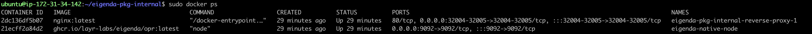

## Installation of EigenDA using docker

### Prerequisites:
* Docker installed
* Eigenlayer CLI installed

> NOTE: For any Docker based commands, if you have installed as root then you might have to append `sudo` in front of the command.

### Core operations
* Register your operator to eigenlayer using [Eigenlayer CLI](https://github.com/NethermindEth/eigenlayer/blob/develop/README.md)

### Setup EigenDA
The easiest way to set up EigenDA is to clone the repo and follow the instructions below.

#### Clone repo
Clone this repo and execute the following commands:
```bash
git clone https://github.com/Layr-Labs/eigenda-operator-setup.git
cd eigenda-operator-setup
chmod +x run.sh
```
Update the `TODO` sections in the  `.env` file given in the root directory of the repository with your own details.:

### Create some local folders which are required by EigenDA
```bash
mkdir -p $HOME/.eigenlayer/eigenda/logs
mkdir -p $HOME/.eigenlayer/eigenda/db
```

### Operator Networking Security Setup
Retrieval Setup:

In order for users to retrieve data from your node, you will need to open access to retrieval ports.

Ensure the port specified as `NODE_RETRIEVAL_PORT` in the [.env](https://github.com/Layr-Labs/eigenda-operator-setup/blob/master/.env#L17) has open access to the public internet.

Dispersal Setup:

In order to limit traffic from the EigenLabs hosted Disperser, please restrict your node's ingress traffic to be allowed by the the list provided below and port number set as `NODE_DISPERSAL_PORT` in the [.env](https://github.com/Layr-Labs/eigenda-operator-setup/blob/master/.env#L14) in the below setup.

* `3.221.120.68/32`
* `52.2.226.152/32`
* `18.214.113.214/32`

### Opt-in into EigenDA
```bash
./run.sh opt-in
```
It will use the `NODE_HOSTNAME` from [.env](.env) as your current IP.

### Run EigenDA
Execute the following command to start the docker containers:
```
docker compose up -d
```
It will start the node and nginx containers and if you do `docker ps` you should see something like this:


you can view the logs using:
```
docker logs -f <container_id>
```
If you have successfully opted in to EigenDA and correctly running your EigenDA software, you should see the following logs for your EigenDA container:

<figure><figcaption></figcaption></figure>

The following example log messages confirm that your EigenDA node software is up and running:

```
2023/11/16 22:21:04 maxprocs: Leaving GOMAXPROCS=16: CPU quota undefined
2023/11/16 22:21:04 Initializing Node
2023/11/16 22:21:07     Reading G1 points (33554432 bytes) takes 14.636544ms
2023/11/16 22:21:10     Parsing takes 3.173737274s
2023/11/16 22:21:10     Reading G2 points (67108864 bytes) takes 29.762221ms
2023/11/16 22:22:04     Parsing takes 53.962254668s
numthread 16
INFO [11-16|22:22:04.447|github.com/Layr-Labs/eigenda/common/logging/logging.go:65] Starting metrics server at port :9092    caller=logging.go:65
INFO [11-16|22:22:04.447|github.com/Layr-Labs/eigenda/node/node.go:155]             Enabled metrics                          socket=:9092 caller=node.go:155
INFO [11-16|22:22:04.447|github.com/Layr-Labs/eigenda/common/logging/logging.go:65] Starting node api server at address localhost:9091 caller=logging.go:65
INFO [11-16|22:22:04.447|github.com/Layr-Labs/eigenda/node/node.go:159]             Enabled node api                         port=9091 caller=node.go:159
INFO [11-16|22:22:04.447|github.com/Layr-Labs/eigenda/node/node.go:166]             Registering node with socket             socket=3.144.180.69:32005;32004 caller=node.go:166
INFO [11-16|22:22:04.447|github.com/Layr-Labs/eigensdk-go/nodeapi/nodeapi.go:240]   node api server running                  addr=localhost:9091 caller=nodeapi.go:240
INFO [11-16|22:22:04.448|github.com/Layr-Labs/eigenda/node/grpc/server.go:119]      port                                     32004=address [::]:32004="GRPC Listening" caller=server.go:119
INFO [11-16|22:22:04.448|github.com/Layr-Labs/eigenda/node/grpc/server.go:95]       port                                     32005=address [::]:32005="GRPC Listening" caller=server.go:95
```

The following example log messages confirm that your node is receiving traffic from the Disperser. If you do not see these log messages then either you have not successfully [opted-in to EigenDA](#opt-in-into-eigenda) or your [network security group](#operator-networking-security-setup) might not be setup correctly.

```
DEBUG[11-16|22:22:29.588|github.com/Layr-Labs/eigenda/node/node.go:275]             Store batch took                         duration:=84.214213ms caller=node.go:275
DEBUG[11-16|22:22:30.016|github.com/Layr-Labs/eigenda/node/node.go:295]             Validate batch took                      duration:=511.828024ms caller=node.go:295
TRACE[11-16|22:22:30.016|github.com/Layr-Labs/eigenda/node/node.go:306]             Signed batch header hash                 pubkey=0x13899af0fedf3378e90f6f377fe70edb9da35b43df5d94a770726fb4c2579df1112ed18cfd4390acc718aae6a60610e3313737f5e2e3403723f84a1752e47d731812c7c36b95c3e206fb44460e8470cc5ef274cbaae5d837d7d032bfb10c34a90d33dad25a1a1f19f453b2b6f0cef854fd381d9b876bcaf4a9562459b23c212d caller=node.go:306
DEBUG[11-16|22:22:30.016|github.com/Layr-Labs/eigenda/node/node.go:309]             Sign batch took                          duration="372.962µs" caller=node.go:309
INFO [11-16|22:22:30.016|github.com/Layr-Labs/eigenda/node/node.go:311]             StoreChunks succeeded                    caller=node.go:311
DEBUG[11-16|22:22:30.016|github.com/Layr-Labs/eigenda/node/node.go:313]             Exiting process batch                    duration=512.422513ms caller=node.go:313
```

Tear down container
```bash
docker compose down
```
### Opt-out into EigenDA
```bash
./run.sh opt-out
```
### Upgrade your node

Upgrade the AVS software for your EigenDA service setup by following the steps below:

**Step 1:** Pull the latest repo

```
cd eigenda-operator-setup
git pull
```

**Step 2:** Pull the latest docker images

```
docker compose pull
```

**Step 3:** Stop the existing services

```
docker compose down
```

**Step 4:** Start your services again

If there are any specific instructions that needs to be followed for any upgrade, those instructions will be given with the release notes of the specific release. Please check the latest [release notes](https://github.com/Layr-Labs/eigenda-operator-setup/releases) on Github and follow the instructions before starting the services again.

```
docker compose up -d
```

## Metrics and Dashboard

### Quickstart
We provide a quickstart guide to run the Prometheus, Grafana, and Node exporter stack.
Checkout the README [here](monitoring/README.md) for more details. If you want to manually set this up, follow the steps below.

### Metrics
To check if the metrics are being emitted, run the following command:
```bash
curl http://localhost:<NODE_METRICS_PORT>/metrics
```

You should see something like
```
# HELP eigen_performance_score The performance metric is a score between 0 and 100 and each developer can define their own way of calculating the score. The score is calculated based on the performance of the Node and the performance of the backing services.
# TYPE eigen_performance_score gauge
eigen_performance_score{avs_name="da-node"} 100
# HELP eigen_registered_stakes Operator stake in <quorum> of <avs_name>'s StakeRegistry contract
# TYPE eigen_registered_stakes gauge
eigen_registered_stakes{avs_name="da-node",quorum_name="eth_quorum",quorum_number="0"} 2.654867142483745e+19
# HELP eigen_rpc_request_duration_seconds Duration of json-rpc <method> in second
...
```
### Prometheus
We will use [prometheus](https://prometheus.io/download) to scrape the metrics from the EigenDA node.

Create the following file in `$HOME/.eigenlayer/config/prometheus.yml`
```yaml
global:
  scrape_interval: 15s # By default, scrape targets every 15 seconds.

  # Attach these labels to any time series or alerts when communicating with
  # external systems (federation, remote storage, Alertmanager).
  external_labels:
    monitor: "codelab-monitor"

# A scrape configuration containing exactly one endpoint to scrape:
# Here it's Prometheus itself.
scrape_configs:
  # The job name is added as a label `job=<job_name>` to any timeseries scraped from this config.
  - job_name: "prometheus"

    # Override the global default and scrape targets from this job every 5 seconds.
    scrape_interval: 5s

    static_configs:
      # Point to the same endpoint that EigenDA is publishing on
      - targets: ["localhost:<NODE_METRICS_PORT>"]
```

Start prometheus
```bash
prometheus --config.file="$HOME/.eigenlayer/config/prometheus.yml"
```

If you want to use docker, follow [this](https://prometheus.io/docs/prometheus/latest/installation/#volumes-bind-mount) link.
```bash
docker run -d \
    -p 9090:9090 \
    -v ~/.eigenlayer/config/prometheus.yml:/etc/prometheus/prometheus.yml \
    prom/prometheus
```

### Grafana
We will use grafana to visualize the metrics from the EigenDA node.

You can use [OSS Grafana](https://grafana.com/oss/grafana/) for it or any other Dashboard provider.

Start the Grafana server
```bash
grafana server
```
You can also use [docker](https://grafana.com/docs/grafana/latest/setup-grafana/installation/docker/)
```bash
docker run -d -p 3000:3000 --name=grafana grafana/grafana-enterprise
```

You should be able to navigate to `http://localhost:3000` and login with `admin`/`admin`.
You will need to add a datasource to Grafana. You can do this by navigating to `http://localhost:3000/datasources` and adding a Prometheus datasource. By default, the Prometheus server is running on `http://localhost:9090`. You can use this as the URL for the datasource.

#### Useful Dashboards
We also provide a set of useful Grafana dashboards which would be useful for monitoring the EigenDA node. You can find them [here](dashboards).
Once you have Grafana setup, feel free to import the dashboards.

### Node exporter
EigenDA emits DA specific metrics but, it's also important to keep track of the node's health. For this, we will use [Node Exporter](https://prometheus.io/docs/guides/node-exporter/) which is a Prometheus exporter for hardware and OS metrics exposed by *NIX kernels, written in Go with pluggable metric collectors.
Install the binary or use docker to [run](https://hub.docker.com/r/prom/node-exporter) it.

```bash
docker pull prom/node-exporter
docker run -d -p 9100:9100 --name node-exporter prom/node-exporter
```
In Grafana dashboard, import the [node-exporter](dashboards/node-exporter.json) to see host metrics.

## Troubleshooting
* If you see the following error:
    ```
    permission denied while trying to connect to the Docker daemon socket at unix:///var/run/docker.sock: Get "http://%2Fvar%2Frun%2Fdocker.sock/v1.24/containers/json": dial unix /var/run/docker.sock: connect: permission denied
    ```
    Use the same command by prepending `sudo` in front of it.
