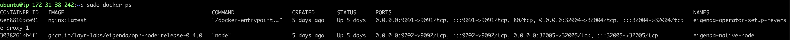

## Installation of EigenDA using docker

### Prerequisites:
* Docker installed
* Eigenlayer CLI installed

> NOTE: For any Docker based commands, if you have installed as root then you might have to append `sudo` in front of the command.

### Core operations
* Register your operator to eigenlayer using [Eigenlayer CLI](https://github.com/NethermindEth/eigenlayer/blob/develop/README.md)

### Setup EigenDA
You can either clone this repo or download the docker compose file and the `.env` file from the repository.

#### Clone repo
Clone this repo and execute the following commands:
```bash
git clone https://github.comLayr-Labs/eigenda-operator-setup.git
cd eigenda-operator-setup
chmod +x run.sh
```
Update the `TODO` sections in the  `.env` file given in the root directory of the repository with your own details.:

### Create some local folders which are required by EigenDA
```bash
mkdir -p $HOME/.eigenlayer/eigenda/logs
mkdir -p $HOME/.eigenlayer/eigenda/db
```

### Opt-in into EigenDA
```bash
./run.sh opt-in
```
It will use the `NODE_HOSTNAME` from [.env](.env) as your current IP.

### Run EigenDA
Execute the following command to start the docker containers:
```
docker compose up -d
```
It will start the node and nginx containers and if you do `docker ps` you should see something like this:


you can view the logs using:
```
docker logs -f <container_id>
```

Tear down container
```bash
docker compose down
```
### Opt-out into EigenDA
```bash
./run.sh opt-out
```

## Metrics and Dashboard

### Quickstart
We provide a quickstart guide to run the Prometheus, Grafana, and Node exporter stack.
Checkout the README [here](monitoring/README.md) for more details. If you want to manually set this up, follow the steps below.

### Metrics
To check if the metrics are being emitted, run the following command:
```bash
curl http://localhost:<NODE_METRICS_PORT>/metrics
```

You should see something like
```
# HELP eigen_performance_score The performance metric is a score between 0 and 100 and each developer can define their own way of calculating the score. The score is calculated based on the performance of the Node and the performance of the backing services.
# TYPE eigen_performance_score gauge
eigen_performance_score{avs_name="da-node"} 100
# HELP eigen_registered_stakes Operator stake in <quorum> of <avs_name>'s StakeRegistry contract
# TYPE eigen_registered_stakes gauge
eigen_registered_stakes{avs_name="da-node",quorum_name="eth_quorum",quorum_number="0"} 2.654867142483745e+19
# HELP eigen_rpc_request_duration_seconds Duration of json-rpc <method> in second
...
```
### Prometheus
We will use [prometheus](https://prometheus.io/download) to scrape the metrics from the EigenDA node.

Create the following file in `$HOME/.eigenlayer/config/prometheus.yml`
```yaml
global:
  scrape_interval: 15s # By default, scrape targets every 15 seconds.

  # Attach these labels to any time series or alerts when communicating with
  # external systems (federation, remote storage, Alertmanager).
  external_labels:
    monitor: "codelab-monitor"

# A scrape configuration containing exactly one endpoint to scrape:
# Here it's Prometheus itself.
scrape_configs:
  # The job name is added as a label `job=<job_name>` to any timeseries scraped from this config.
  - job_name: "prometheus"

    # Override the global default and scrape targets from this job every 5 seconds.
    scrape_interval: 5s

    static_configs:
      # Point to the same endpoint that EigenDA is publishing on
      - targets: ["localhost:<NODE_METRICS_PORT>"]
```

Start prometheus
```bash
prometheus --config.file="$HOME/.eigenlayer/config/prometheus.yml"
```

If you want to use docker, follow [this](https://prometheus.io/docs/prometheus/latest/installation/#volumes-bind-mount) link.
```bash
docker run -d \
    -p 9090:9090 \
    -v ~/.eigenlayer/config/prometheus.yml:/etc/prometheus/prometheus.yml \
    prom/prometheus
```

### Grafana
We will use grafana to visualize the metrics from the EigenDA node.

You can use [OSS Grafana](https://grafana.com/oss/grafana/) for it or any other Dashboard provider.

Start the Grafana server
```bash
grafana server
```
You can also use [docker](https://grafana.com/docs/grafana/latest/setup-grafana/installation/docker/)
```bash
docker run -d -p 3000:3000 --name=grafana grafana/grafana-enterprise
```

You should be able to navigate to `http://localhost:3000` and login with `admin`/`admin`.
You will need to add a datasource to Grafana. You can do this by navigating to `http://localhost:3000/datasources` and adding a Prometheus datasource. By default, the Prometheus server is running on `http://localhost:9090`. You can use this as the URL for the datasource.

#### Useful Dashboards
We also provide a set of useful Grafana dashboards which would be useful for monitoring the EigenDA node. You can find them [here](dashboards).
Once you have Grafana setup, feel free to import the dashboards.

### Node exporter
EigenDA emits DA specific metrics but, it's also important to keep track of the node's health. For this, we will use [Node Exporter](https://prometheus.io/docs/guides/node-exporter/) which is a Prometheus exporter for hardware and OS metrics exposed by *NIX kernels, written in Go with pluggable metric collectors.
Install the binary or use docker to [run](https://hub.docker.com/r/prom/node-exporter) it.

```bash
docker pull prom/node-exporter
docker run -d -p 9100:9100 --name node-exporter prom/node-exporter
```
In Grafana dashboard, import the [node-exporter](dashboards/node-exporter.json) to see host metrics.

## Troubleshooting
* If you see the following error:
    ```
    permission denied while trying to connect to the Docker daemon socket at unix:///var/run/docker.sock: Get "http://%2Fvar%2Frun%2Fdocker.sock/v1.24/containers/json": dial unix /var/run/docker.sock: connect: permission denied
    ```
    Use the same command by prepending `sudo` in front of it.
