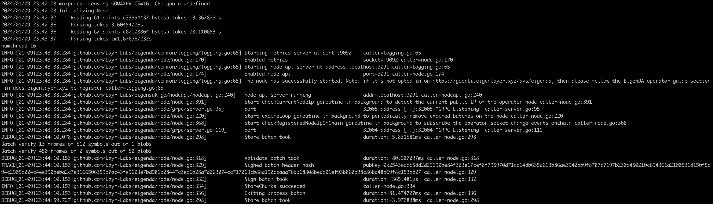

## Installation of EigenDA using docker

### Prerequisites:
* Docker installed
* [EigenLayer CLI](https://github.com/Layr-Labs/eigenlayer-cli) installed

> NOTE: For any Docker based commands, if you have installed as root then you might have to append `sudo` in front of the command.

### Core operations
* Register your operator to EigenLayer using [EigenLayer CLI](https://github.com/Layr-Labs/eigenlayer-cli/blob/master/README.md)

### Setup EigenDA
The easiest way to set up EigenDA is to clone the repo and follow the instructions below.

#### Clone repo
Clone this repo and execute the following commands:
```bash
git clone https://github.com/Layr-Labs/eigenda-operator-setup.git
cd eigenda-operator-setup/goerli/
cp .env.example .env
```
Update the `TODO` sections in the  `.env` file given in the root directory of the repository with your own details.:

### Create some local folders which are required by EigenDA
```bash
mkdir -p $HOME/.eigenlayer/eigenda/goerli/logs
mkdir -p $HOME/.eigenlayer/eigenda/goerli/db
```

### Operator Networking Security Setup
Retrieval Setup:

In order for users to retrieve data from your node, you will need to open access to retrieval ports. 

Ensure the port specified as `NODE_RETRIEVAL_PORT` in the [.env](https://github.com/Layr-Labs/eigenda-operator-setup/blob/master/goerli/.env.example#L17) has open access to the public internet.

For users with private IP e.g. connecting to the Internet via a router, you may need to perform port forwarding to open the retrieval ports. 
Use a web browser and navigate to http://192.168.0.1 and set-up port forwarding according to instruction of your router.

Dispersal Setup:

In order to limit traffic from the EigenLabs hosted Disperser, please restrict your node's ingress traffic to be allowed by the list provided below and port number set as `NODE_DISPERSAL_PORT` in the [.env](./.env.example) in the below setup.

* `3.221.120.68/32`
* `52.2.226.152/32`
* `18.214.113.214/32`

For users with private IP, you may need to perform port forwarding to open the dispersal ports. Refer to retrieval setup for more details.

### Opt-in into EigenDA
This command also downloads the latest SRS points (~8 GB) if they don't exist and can take upto 10 minutes to complete for the first time based on your network speed.
```bash
./run.sh opt-in
```
It will use the `NODE_HOSTNAME` from [.env](./.env.example) as your current IP.

### Run EigenDA
Execute the following command to start the docker containers:
```
docker compose up -d
```
It will start the node and nginx containers and if you do `docker ps` you should see something like this:


you can view the logs using:
```
docker logs -f <container_id>
```
If you have successfully opted in to EigenDA and correctly running your EigenDA software, you should see the following logs for your EigenDA container:

[](./images/eigenda-logs.png)

The following example log messages confirm that your EigenDA node software is up and running:

```
2024/01/09 23:42:28 maxprocs: Leaving GOMAXPROCS=16: CPU quota undefined
2024/01/09 23:42:28 Initializing Node
2024/01/09 23:42:32     Reading G1 points (33554432 bytes) takes 13.362879ms
2024/01/09 23:42:36     Parsing takes 3.60454026s
2024/01/09 23:42:36     Reading G2 points (67108864 bytes) takes 28.110653ms
2024/01/09 23:43:37     Parsing takes 1m1.676967232s
numthread 16
INFO [01-09|23:43:38.284|github.com/Layr-Labs/eigenda/common/logging/logging.go:65] Starting metrics server at port :9092    caller=logging.go:65
INFO [01-09|23:43:38.284|github.com/Layr-Labs/eigenda/node/node.go:170]             Enabled metrics                          socket=:9092 caller=node.go:170
INFO [01-09|23:43:38.284|github.com/Layr-Labs/eigenda/common/logging/logging.go:65] Starting node api server at address localhost:9091 caller=logging.go:65
INFO [01-09|23:43:38.284|github.com/Layr-Labs/eigenda/node/node.go:174]             Enabled node api                         port=9091 caller=node.go:174
INFO [01-09|23:43:38.284|github.com/Layr-Labs/eigenda/common/logging/logging.go:65] The node has successfully started. Note: if it's not opted in on https://goerli.eigenlayer.xyz/avs/eigenda, then please follow the EigenDA operator guide section in docs.eigenlayer.xyz to register caller=logging.go:65
INFO [01-09|23:43:38.284|github.com/Layr-Labs/eigensdk-go/nodeapi/nodeapi.go:240]   node api server running                  addr=localhost:9091 caller=nodeapi.go:240
INFO [01-09|23:43:38.284|github.com/Layr-Labs/eigenda/node/node.go:391]             Start checkCurrentNodeIp goroutine in background to detect the current public IP of the operator node caller=node.go:391
INFO [01-09|23:43:38.284|github.com/Layr-Labs/eigenda/node/grpc/server.go:95]       port                                     32005=address [::]:32005="GRPC Listening" caller=server.go:95
INFO [01-09|23:43:38.284|github.com/Layr-Labs/eigenda/node/node.go:220]             Start expireLoop goroutine in background to periodically remove expired batches on the node caller=node.go:220
INFO [01-09|23:43:38.284|github.com/Layr-Labs/eigenda/node/node.go:368]             Start checkRegisteredNodeIpOnChain goroutine in background to subscribe the operator socket change events onchain caller=node.go:368
INFO [01-09|23:43:38.284|github.com/Layr-Labs/eigenda/node/grpc/server.go:119]      port                                     32004=address [::]:32004="GRPC Listening" caller=server.go:119
```

The following example log messages confirm that your node is receiving traffic from the Disperser. If you do not see these log messages then either you have not successfully [opted-in to EigenDA](#opt-in-into-eigenda) or your [network security group](#operator-networking-security-setup) might not be setup correctly.

```
DEBUG[01-09|23:44:10.078|github.com/Layr-Labs/eigenda/node/node.go:298]             Store batch took                         duration:=5.831581ms caller=node.go:298
Batch verify 13 frames of 512 symbols out of 1 blobs
Batch verify 450 frames of 2 symbols out of 50 blobs
DEBUG[01-09|23:44:10.153|github.com/Layr-Labs/eigenda/node/node.go:318]             Validate batch took                      duration:=80.907297ms caller=node.go:318
TRACE[01-09|23:44:10.153|github.com/Layr-Labs/eigenda/node/node.go:329]             Signed batch header hash                 pubkey=0x2543eddc5dd2d29190be84f323e17cef8f795970d71cc14db635a613b86ae3942bb9f8787d7197b230d450210c694361a2100531d150f5a94c2905a224c4ee390beba2c7e3166506359b7ac43fe9603e7bd981b28447c3ed6b28a7d263274cc717263cb88a192ccaaa76bb68308beaa01ef93b862b98c86ba48b69f8c153ad27 caller=node.go:329
DEBUG[01-09|23:44:10.153|github.com/Layr-Labs/eigenda/node/node.go:332]             Sign batch took                          duration="365.481µs" caller=node.go:332
INFO [01-09|23:44:10.153|github.com/Layr-Labs/eigenda/node/node.go:334]             StoreChunks succeeded                    caller=node.go:334
DEBUG[01-09|23:44:10.153|github.com/Layr-Labs/eigenda/node/node.go:336]             Exiting process batch                    duration=81.474727ms caller=node.go:336
DEBUG[01-09|23:44:59.727|github.com/Layr-Labs/eigenda/node/node.go:298]             Store batch took                         duration:=3.972838ms  caller=node.go:298
Batch verify 8 frames of 4 symbols out of 1 blobs
Batch verify 432 frames of 2 symbols out of 48 blobs
DEBUG[01-09|23:44:59.805|github.com/Layr-Labs/eigenda/node/node.go:318]             Validate batch took                      duration:=82.711666ms caller=node.go:318
TRACE[01-09|23:44:59.806|github.com/Layr-Labs/eigenda/node/node.go:329]             Signed batch header hash                 pubkey=0x2543eddc5dd2d29190be84f323e17cef8f795970d71cc14db635a613b86ae3942bb9f8787d7197b230d450210c694361a2100531d150f5a94c2905a224c4ee390beba2c7e3166506359b7ac43fe9603e7bd981b28447c3ed6b28a7d263274cc717263cb88a192ccaaa76bb68308beaa01ef93b862b98c86ba48b69f8c153ad27 caller=node.go:329
DEBUG[01-09|23:44:59.806|github.com/Layr-Labs/eigenda/node/node.go:332]             Sign batch took                          duration="370.048µs" caller=node.go:332
INFO [01-09|23:44:59.806|github.com/Layr-Labs/eigenda/node/node.go:334]             StoreChunks succeeded                    caller=node.go:334
DEBUG[01-09|23:44:59.806|github.com/Layr-Labs/eigenda/node/node.go:336]             Exiting process batch                    duration=83.241162ms caller=node.go:336
DEBUG[01-09|23:45:49.698|github.com/Layr-Labs/eigenda/node/node.go:298]             Store batch took                         duration:=4.118867ms  caller=node.go:298
Batch verify 477 frames of 2 symbols out of 53 blobs
DEBUG[01-09|23:45:49.771|github.com/Layr-Labs/eigenda/node/node.go:318]             Validate batch took                      duration:=77.685497ms caller=node.go:318
TRACE[01-09|23:45:49.771|github.com/Layr-Labs/eigenda/node/node.go:329]             Signed batch header hash                 pubkey=0x2543eddc5dd2d29190be84f323e17cef8f795970d71cc14db635a613b86ae3942bb9f8787d7197b230d450210c694361a2100531d150f5a94c2905a224c4ee390beba2c7e3166506359b7ac43fe9603e7bd981b28447c3ed6b28a7d263274cc717263cb88a192ccaaa76bb68308beaa01ef93b862b98c86ba48b69f8c153ad27 caller=node.go:329
DEBUG[01-09|23:45:49.771|github.com/Layr-Labs/eigenda/node/node.go:332]             Sign batch took                          duration="345.3µs"   caller=node.go:332
INFO [01-09|23:45:49.772|github.com/Layr-Labs/eigenda/node/node.go:334]             StoreChunks succeeded                    caller=node.go:334
DEBUG[01-09|23:45:49.772|github.com/Layr-Labs/eigenda/node/node.go:336]             Exiting process batch                    duration=78.216395ms caller=node.go:336
```

Tear down container
```bash
docker compose down
```
### Opt-out into EigenDA
```bash
./run.sh opt-out
```

### Update Quorums (Optional)
If you want to update the quorums, update the `NODE_QUORUM_ID_LIST` in your .env file
to have a command separated value of new quorums (for ex: `0,1`) then running the following command:
> **_NOTE:_** This command sends two transactions (opt-out and opt-in again). 
> This means if it opts-in again it will have to go via churner and will check the TVL based on lowest stake if the network is full.
```bash
./run.sh update-quorums
```

### Upgrade your node

Upgrade the AVS software for your EigenDA service setup by following the steps below:

**Step 1:** Pull the latest repo and update version

```
cd eigenda-operator-setup
git pull
cd goerli
```
Update the `MAIN_SERVICE_IMAGE` in your `.env` file with the latest EigenDA version as per the release notes.

> **_NOTE:_** If there are any specific instructions that needs to be followed for any upgrade, those instructions will be given with the release notes of the specific release. Please check the latest [release notes](https://github.com/Layr-Labs/eigenda-operator-setup/releases) on GitHub and follow the instructions before starting the services again.

**Step 2:** Pull the latest Docker images

```
docker compose pull
```

**Step 3:** Stop the existing services

```
docker compose down
```

**Step 4:** Start your services again

Make sure your `.env` file still has correct values in the TODO sections before you restart your node.

```
docker compose up -d
```

## Metrics and Dashboard
Head over to the [Monitoring](../monitoring/README.md) section to setup monitoring for your EigenDA node.

## Troubleshooting
* If you see the following error:
    ```
    permission denied while trying to connect to the Docker daemon socket at unix:///var/run/docker.sock: Get "http://%2Fvar%2Frun%2Fdocker.sock/v1.24/containers/json": dial unix /var/run/docker.sock: connect: permission denied
    ```
    Use the same command by prepending `sudo` in front of it.
